## 🎉 FUN WITH CATEGORIES 🎉

#### Marco Perone

[`statebox.org`](https://statebox.org)

<!-- TODO add better layout for the title page -->

---

## About Marco

- PhD Mathematics, *University of Padua*
- Functional Programmer at Statebox

notes:

I tweet, I blog, I contribute to open source, you can find more info about me on the statebox website

---

## About Statebox

#### » Applying Category Theory «

**Categorical-** *Software, Hardware, Distributed Systems, Cryptography, ...*

notes:

Statebox is building a suite categorical programming tools

---

## What is category theory?

notes:

- general setting to speak about composition and computation
- provides concepts as `Functor`, `Monad`, `Natural Transformation`

---

> Category Theory is indeed general abstract nonsense
> and that it is precisely because of that that it is
> so important both mathematically and philosophically.

from ["What is Category Theory?"](https://zenodo.org/record/584073/files/MarquisPoli2006.pdf)

by [Jean-Pierre Marquis](https://recherche.umontreal.ca/english/our-researchers/professors-directory/researcher/is/in15376/)

notes:

what is category theory?

even among mathematicians sometimes described as abstract nonsense

but that is good because:

- no noise
- general

---

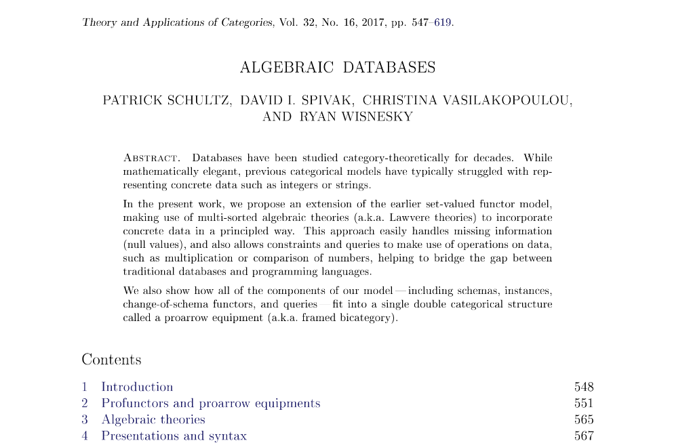

notes:

databases and data migrations

---

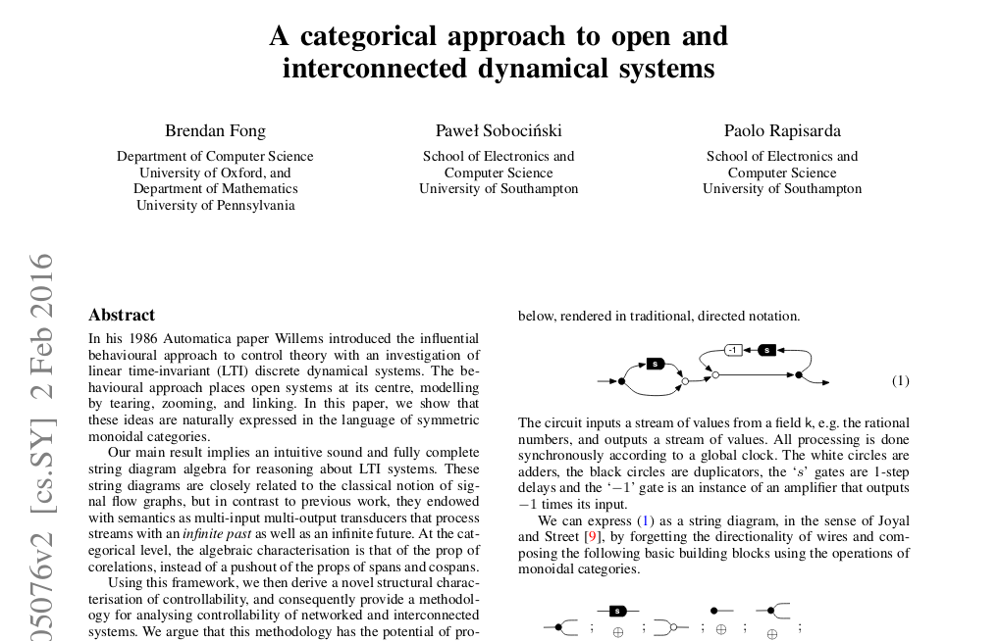

notes:

dynamical systems

---

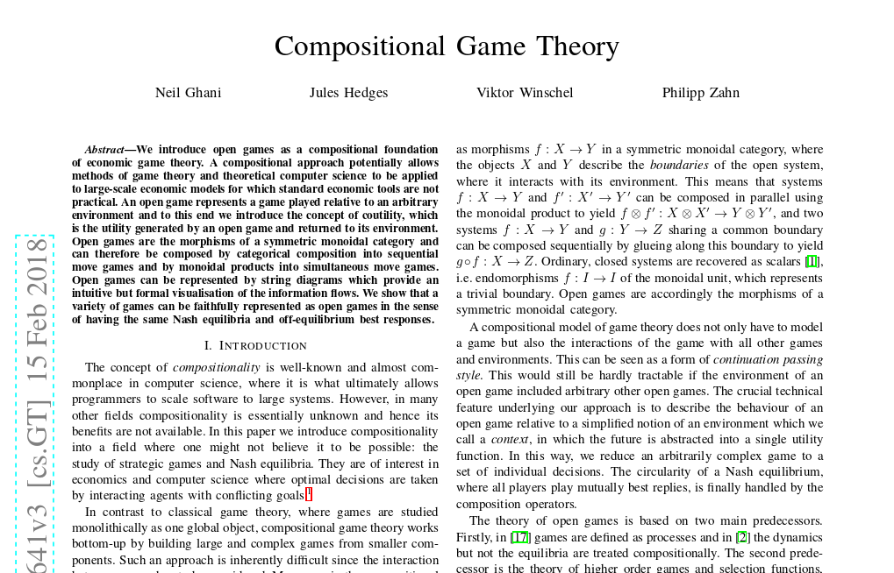

notes:

game theory

---

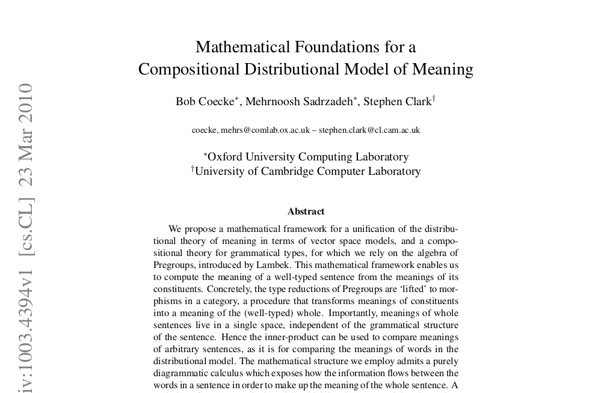

notes:

linguistics

---

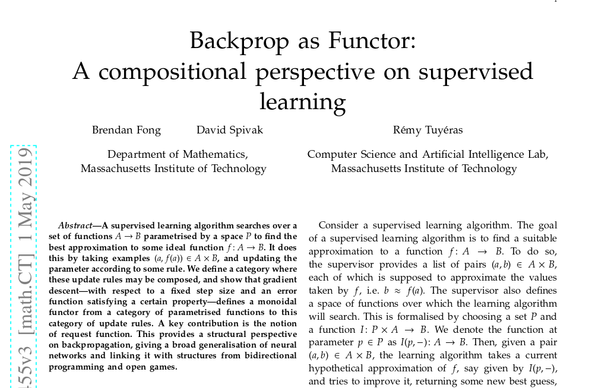

notes:

machine learning

---

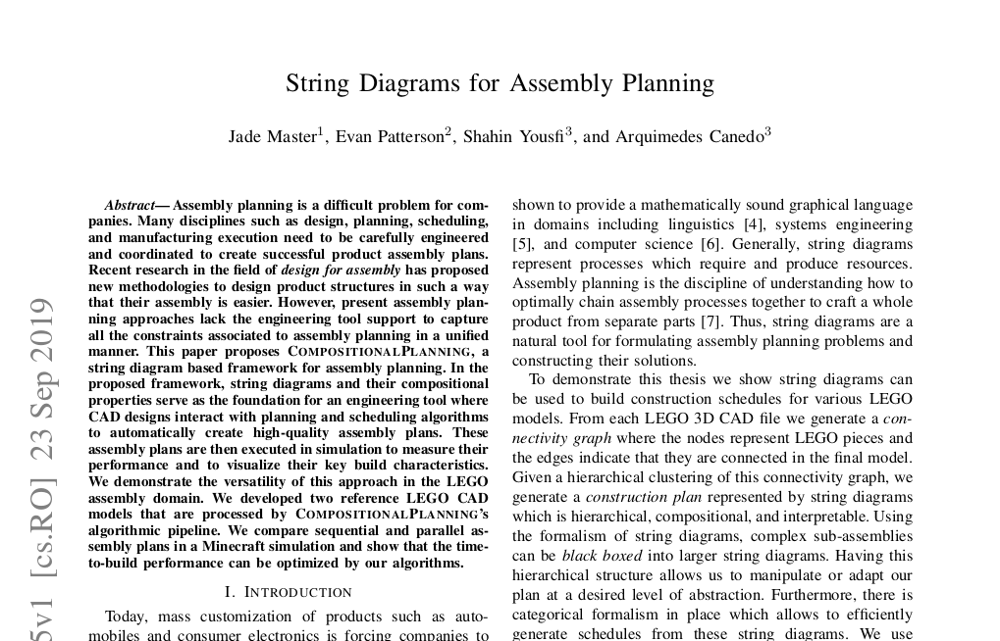

notes:

manufacturing

---

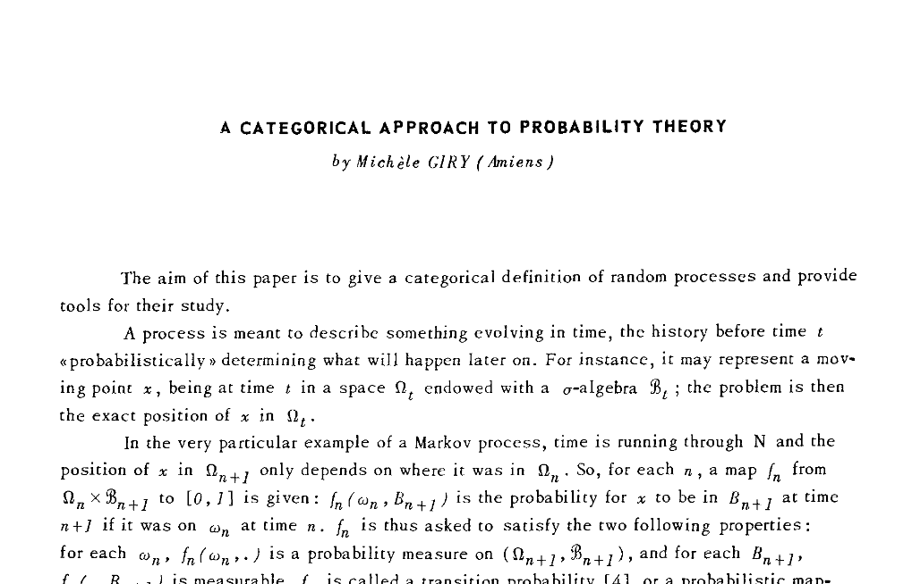

notes:

probability

---

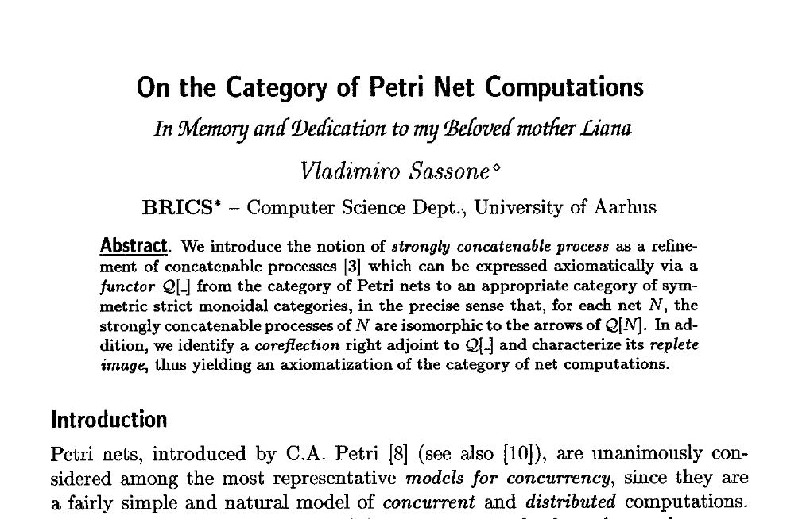

notes:

processes
concurrent and distibuted computations

---

[github.com/statebox/awesome-applied-ct](https://github.com/statebox/awesome-applied-category-theory)

notes:

many more resources here

if we really want to apply CT to these fields, we want to write software

we need sofware which speaks CT

---

## A Category Theory library

- practically usable <!-- .element: class="fragment" data-fragment-index="1" -->
- verified <!-- .element: class="fragment" data-fragment-index="2" -->

notes:

we need to have the same safety which math provides (even more, because proof checked)

still, not too abstract so that it becomes impractical

---

[idris-lang.org](idris-lang.org)


notes:

general purpose pure functional programming language
with dependent types

---

## Types allow us to encode proofs

```haskell
data LTE  : (n, m : Nat) -> Type where
  LTEZero : LTE Z    right
  LTESucc : LTE left right -> LTE (S left) (S right)
```

---

Haskell

```haskell
head : List A -> A
```

Safer Haskell <!-- .element: class="fragment" data-fragment-index="1" -->

```haskell
headMaybe : List A -> Maybe A
```
<!-- .element: class="fragment" data-fragment-index="1" -->

Idris <!-- .element: class="fragment" data-fragment-index="2" -->

```haskell
nonEmptyHead : (l : List A ** IsNonEmpty l) -> A
```
<!-- .element: class="fragment" data-fragment-index="2" -->

---

## What is a category?

---

<!-- .slide: data-transition="slide-in none-out" -->

Objects

<object data="img/category/objects.svg" type="image/svg+xml"></object>

---

<!-- .slide: data-transition="fade-in fade-out" -->

Morphisms

<object data="img/category/morphisms.svg" type="image/svg+xml"></object>

---

<!-- .slide: data-transition="fade-in fade-out" -->

Composition

<object data="img/category/composition1.svg" type="image/svg+xml"></object>

---

<!-- .slide: data-transition="fade-in fade-out" -->

Composition

<object data="img/category/composition2.svg" type="image/svg+xml"></object>

---

<!-- .slide: data-transition="fade-in fade-out" -->

Composition

<object data="img/category/composition3.svg" type="image/svg+xml"></object>

---

<!-- .slide: data-transition="fade-in fade-out" -->

Composition

<object data="img/category/composition4.svg" type="image/svg+xml"></object>

---

<!-- .slide: data-transition="fade-in fade-out" -->

Composition

<object data="img/category/composition5.svg" type="image/svg+xml"></object>

---

<!-- .slide: data-transition="fade-in fade-out" -->

Composition

<object data="img/category/composition6.svg" type="image/svg+xml"></object>

---

<!-- .slide: data-transition="fade-in fade-out" -->

Composition

<object data="img/category/composition7.svg" type="image/svg+xml"></object>

---

<!-- .slide: data-transition="fade-in fade-out" -->

Composition

<object data="img/category/composition8.svg" type="image/svg+xml"></object>

---

<!-- .slide: data-transition="fade-in fade-out" -->

Identities

<object data="img/category/identities1.svg" type="image/svg+xml"></object>

---

<!-- .slide: data-transition="fade-in fade-out" -->

Identities

<object data="img/category/identities2.svg" type="image/svg+xml"></object>

---

<!-- .slide: data-transition="fade-in fade-out" -->

Coherence conditions

<object data="img/category/category.svg" type="image/svg+xml"></object>

---

<!-- .slide: data-transition="fade-in fade-out" -->

Left identity

<object data="img/category/left-identity1.svg" type="image/svg+xml"></object>

---

<!-- .slide: data-transition="fade-in fade-out" -->

Left identity

<object data="img/category/left-identity2.svg" type="image/svg+xml"></object>

---

<!-- .slide: data-transition="fade-in fade-out" -->

Right identity

<object data="img/category/right-identity1.svg" type="image/svg+xml"></object>

---

<!-- .slide: data-transition="fade-in fade-out" -->

Right identity

<object data="img/category/left-identity2.svg" type="image/svg+xml"></object>

---

<!-- .slide: data-transition="fade-in fade-out" -->

Associativity

<object data="img/category/associativity1.svg" type="image/svg+xml"></object>

---

<!-- .slide: data-transition="fade-in fade-out" -->

Associativity

<object data="img/category/associativity2.svg" type="image/svg+xml"></object>

---

<!-- .slide: data-transition="fade-in fade-out" -->

Associativity

<object data="img/category/associativity3.svg" type="image/svg+xml"></object>

---

<!-- .slide: data-transition="fade-in fade-out" -->

Associativity

<object data="img/category/associativity4.svg" type="image/svg+xml"></object>

---

<!-- .slide: data-transition="fade-in fade-out" -->

Associativity

<object data="img/category/associativity5.svg" type="image/svg+xml"></object>

---

<!-- .slide: data-transition="fade-in fade-out" -->

Associativity

<object data="img/category/associativity6.svg" type="image/svg+xml"></object>

---

## What is a functor?

---

Mapping objects

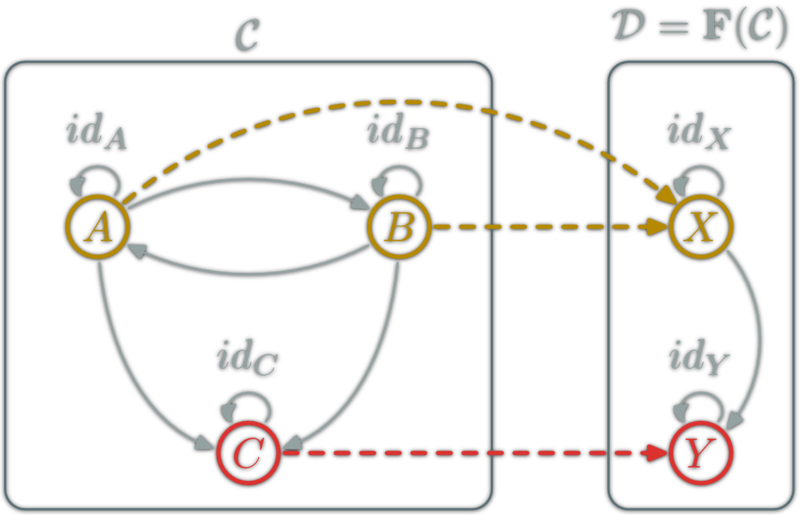

---

Mapping morphisms

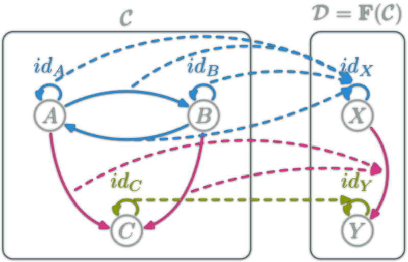

---

## DEMO TIME

---

<!-- .slide: data-transition="slide-in fade-out" -->

Consider a graph

<object data="img/graph/graph.svg" type="image/svg+xml"></object>

---

<!-- .slide: data-transition="fade-in fade-out" -->

Make a category out of it

<object data="img/graph/category.svg" type="image/svg+xml"></object>

---

<!-- .slide: data-transition="fade-in fade-out" -->

Map out of it with a functor

<object data="img/graph/graph.svg" type="image/svg+xml"></object>

---

<!-- .slide: data-transition="fade-in fade-out" -->

Map out of it with a functor

<object data="img/graph/functor1.svg" type="image/svg+xml"></object>

---

<!-- .slide: data-transition="fade-in fade-out" -->

Map out of it with a functor

<object data="img/graph/functor2.svg" type="image/svg+xml"></object>

---

<!-- .slide: data-transition="fade-in fade-out" -->

Choose a path

<object data="img/graph/path.svg" type="image/svg+xml"></object>

---

<!-- .slide: data-transition="fade-in fade-out" -->

Provide initial value

<object data="img/graph/initial.svg" type="image/svg+xml"></object>

---

## Recap

- Categorise it <!-- .element: class="fragment" data-fragment-index="1" -->
- Add a semantic <!-- .element: class="fragment" data-fragment-index="2" -->
- 🎉 PROFIT 🎉 <!-- .element: class="fragment" data-fragment-index="3" -->

---

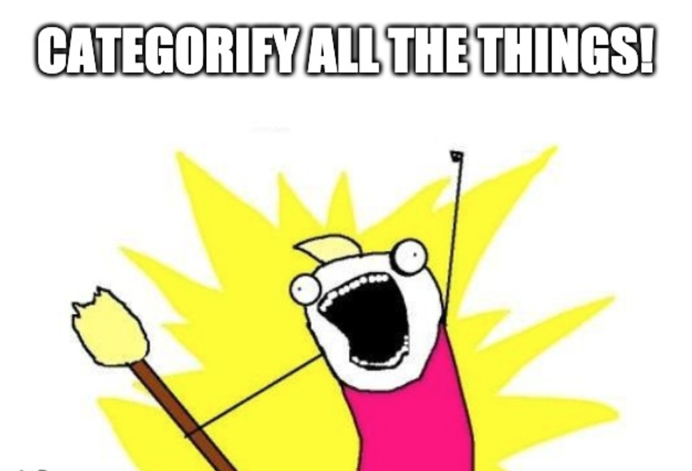

notes:

our mission

---

## Thank you!

Follow: [@marcoshuttle](https://twitter.com/marcoshuttle) & [@statebox](https://twitter.com/statebox)

##### To learn more, check out:

- [statebox.org](https://statebox.org)
- [github.com/statebox/idris-ct](https://github.com/statebox/idris-ct),
- [github.com/statebox/awesome-applied-ct](https://github.com/statebox/awesome-applied-ct)
- [t.me/appliedcategorytheory](https://t.me/appliedcategorytheory) (telegram)
- [t.me/stateboxorg](https://t.me/stateboxorg) (telegram)

<!--
[github.com/marcosh](https://github.com/marcosh)
[marcosh.github.com](https://marcosh.github.com)
[medium.com/@marcosh](https://medium.com/@marcosh)
[github.com/marcosh/fun-with-categories-talk](https://github.com/marcosh/fun-with-categories-talk)
-->
